# ONDEMANDENV Complete SDLC Guide

**From Architecture Design to Production Operations: A Comprehensive Guide**

[](https://ondemandenv.dev)
[](https://aws.amazon.com/cdk/)
[](https://www.typescriptlang.org/)

This guide demonstrates the complete Software Development Lifecycle (SDLC) using ONDEMANDENV through the Coffee Shop microservices example. Learn how to transform distributed system complexity into manageable, code-driven architecture.

---

## 📋 Table of Contents

1. [🏗️ Architecture Design Phase](#️-architecture-design-phase)
2. [📝 Contract Definition Phase](#-contract-definition-phase) 
3. [⚙️ Service Implementation Phase](#️-service-implementation-phase)
4. [🚀 Platform Integration Phase](#-platform-integration-phase)
5. [👨‍💻 Development Workflow](#-development-workflow)
6. [🏭 Production Deployment](#-production-deployment)
7. [📊 Operations & Monitoring](#-operations--monitoring)
8. [🎯 Advanced Patterns](#-advanced-patterns)
9. [🔧 Troubleshooting Guide](#-troubleshooting-guide)

---

## 🏗️ Architecture Design Phase

### System Overview

The Coffee Shop demonstrates a modern **event-driven microservices architecture** with clear service boundaries and explicit dependencies:

```mermaid
graph TB
    subgraph "Coffee Shop Ecosystem"
        F[Foundation Service<br/>📦 Infrastructure Provider]
        OM[Order Manager<br/>📋 Order Orchestration]
        OP[Order Processor<br/>⚙️ Fulfillment Engine]
        
        F -->|EventBridge + DynamoDB| OM
        F -->|EventBridge + DynamoDB| OP
        OM -->|Order Events| OP
    end
    
    subgraph "Platform Services"
        AUTH[🔐 User Authentication]
        EKS[☸️ EKS Clusters]
        NET[🌐 Networking]
    end
    
    subgraph "AWS Multi-Account"
        subgraph "workspace1"
            F1[Foundation]
            OM1[Order Manager]
            OP1[Order Processor]
        end
        subgraph "workspace0"
            AUTH1[Auth Service]
            EKS1[EKS Cluster]
        end
        subgraph "networking"
            NET1[VPC/TGW]
        end
    end
```



### Key Architecture Principles

#### 🎯 **Application-Centric Infrastructure**
```typescript
// Each service owns its complete vertical slice
export class CoffeeShopFoundationStack extends Stack {
    constructor() {
        // Infrastructure: EventBridge, DynamoDB, IAM
        // Runtime: Lambda functions, API Gateway
        // Security: IAM roles, resource policies
        // Monitoring: CloudWatch, X-Ray
    }
}
```

#### 🔗 **Explicit Contract Boundaries**
```typescript
// Products: What service provides
readonly eventBusSrc: EvBusSrcRefProducer;
readonly configTableName: OdmdCrossRefProducer<CoffeeShopFoundationEnver>;

// Consumers: What service requires
readonly eventBusConsumer: OdmdCrossRefConsumer<FoundationEnver>;
```

#### 🌍 **Cross-Account Deployment Strategy**
- **central** (`590184031795`): Platform orchestration engine
- **networking** (`590183907424`): Shared VPC, Transit Gateway
- **workspace0** (`975050243618`): Platform services (Auth, EKS)
- **workspace1** (`590184130740`): Coffee shop applications

---

## 📝 Contract Definition Phase

### Step 1: Define Service Boundaries

Create the **ContractsLib** - your system's architectural constitution:

```typescript
// lib/OndemandContractsSandbox.ts
export class OndemandContractsSandbox extends OndemandContracts {
    constructor(app: App) {
        super(app, 'OndemandContractsSandbox');
        
        // Initialize service contracts
        this.coffeeShopFoundationCdk = new CoffeeShopFoundationCdk(this);
        this.coffeeShopOrderManagerCdk = new CoffeeShopOrderManagerCdk(this);
        this.coffeeShopOrderProcessorCdk = new CoffeeShopOrderProcessorCdk(this);
    }
}
```

### Step 2: Foundation Service Contract

**Role**: Shared infrastructure provider for the entire coffee shop ecosystem

```typescript
// lib/repos/coffee-shop/coffee-shop-foundation-cdk.ts
export class CoffeeShopFoundationEnver extends OdmdEnverCdk {
    constructor(owner: CoffeeShopFoundationCdk, 
                targetAccount: string, 
                targetRegion: string, 
                targetRevision: SRC_Rev_REF) {
        super(owner, targetAccount, targetRegion, targetRevision);
        
        // 📤 PRODUCTS: What this service provides to others
        this.eventBusSrc = new EvBusSrcRefProducer(this, 'EventBusSource');
        this.configTableName = new OdmdCrossRefProducer(this, 'ConfigTable');  
        this.countTableName = new OdmdCrossRefProducer(this, 'CounterTable');
    }

    // Service interface definition
    readonly eventBusSrc: EvBusSrcRefProducer;
    readonly configTableName: OdmdCrossRefProducer<CoffeeShopFoundationEnver>;
    readonly countTableName: OdmdCrossRefProducer<CoffeeShopFoundationEnver>;
}

export class CoffeeShopFoundationCdk extends OdmdBuild<CoffeeShopFoundationEnver> {
    constructor(scope: OndemandContractsSandbox) {
        super(scope, 'coffee-shop-foundation', scope.githubRepos.CoffeeShopFoundationCdk);
    }

    protected initializeEnvers(): void {
        // Define deployment targets
        this._theOne = new CoffeeShopFoundationEnver(
            this,
            this.contracts.accounts.workspace1,  // Target AWS account
            'us-west-1',                         // Target region
            new SRC_Rev_REF('b', 'main')         // Git branch (incremental)
        );
        
        // Production immutable version
        this._prod = new CoffeeShopFoundationEnver(
            this, 
            this.contracts.accounts.workspace1, 
            'us-west-1',
            new SRC_Rev_REF('t', 'v1.0.0')      // Git tag (immutable)
        );
        
        this._envers = [this._theOne, this._prod];
    }
}
```

### Step 3: Order Manager Contract

**Role**: Order lifecycle orchestration with state machine workflows

```typescript
// lib/repos/coffee-shop/coffee-shop-order-manager-cdk.ts
export class CoffeeShopOrderManagerEnver extends OdmdEnverCdk {
    constructor(owner: CoffeeShopOrderManagerCdk,
                targetAccount: string,
                targetRegion: string, 
                targetRevision: SRC_Rev_REF) {
        super(owner, targetAccount, targetRegion, targetRevision);

        // 📥 CONSUMERS: Explicit dependencies on foundation services
        const foundation = owner.contracts.coffeeShopFoundationCdk.theOne;
        
        this.eventBusConsumer = new OdmdCrossRefConsumer(
            this, 'EventBus', foundation.eventBusSrc
        );
        this.configTableConsumer = new OdmdCrossRefConsumer(
            this, 'ConfigTable', foundation.configTableName
        );
        this.countTableConsumer = new OdmdCrossRefConsumer(
            this, 'CountTable', foundation.countTableName
        );
        
        // 📤 PRODUCTS: What this service provides
        this.orderApiEndpoint = new OdmdCrossRefProducer(this, 'OrderAPI');
        this.orderStatusEvents = new EvBusSrcRefProducer(this, 'OrderStatusEvents');
    }

    // Dependency declarations
    readonly eventBusConsumer: OdmdCrossRefConsumer<CoffeeShopOrderManagerEnver, CoffeeShopFoundationEnver>;
    readonly configTableConsumer: OdmdCrossRefConsumer<CoffeeShopOrderManagerEnver, CoffeeShopFoundationEnver>;
    readonly countTableConsumer: OdmdCrossRefConsumer<CoffeeShopOrderManagerEnver, CoffeeShopFoundationEnver>;
    
    // Service interface
    readonly orderApiEndpoint: OdmdCrossRefProducer<CoffeeShopOrderManagerEnver>;
    readonly orderStatusEvents: EvBusSrcRefProducer;
}
```

### Step 4: Order Processor Contract

**Role**: Order fulfillment processing engine

```typescript
// lib/repos/coffee-shop/coffee-shop-order-processor-cdk.ts
export class CoffeeShopOrderProcessorEnver extends OdmdEnverCdk {
    constructor(owner: CoffeeShopOrderProcessorCdk,
                targetAccount: string,
                targetRegion: string,
                targetRevision: SRC_Rev_REF) {
        super(owner, targetAccount, targetRegion, targetRevision);

        // Dependencies on foundation AND order manager
        const foundation = owner.contracts.coffeeShopFoundationCdk.theOne;
        const orderManager = owner.contracts.coffeeShopOrderManagerCdk.theOne;
        
        // Foundation dependencies
        this.eventBusConsumer = new OdmdCrossRefConsumer(
            this, 'EventBus', foundation.eventBusSrc
        );
        this.configTableConsumer = new OdmdCrossRefConsumer(
            this, 'ConfigTable', foundation.configTableName
        );
        
        // Order manager dependencies
        this.orderStatusConsumer = new OdmdCrossRefConsumer(
            this, 'OrderStatus', orderManager.orderStatusEvents
        );
        
        // Service outputs
        this.fulfillmentEvents = new EvBusSrcRefProducer(this, 'FulfillmentEvents');
    }

    readonly eventBusConsumer: OdmdCrossRefConsumer<CoffeeShopOrderProcessorEnver, CoffeeShopFoundationEnver>;
    readonly configTableConsumer: OdmdCrossRefConsumer<CoffeeShopOrderProcessorEnver, CoffeeShopFoundationEnver>;
    readonly orderStatusConsumer: OdmdCrossRefConsumer<CoffeeShopOrderProcessorEnver, CoffeeShopOrderManagerEnver>;
    readonly fulfillmentEvents: EvBusSrcRefProducer;
}
```

### Step 5: Contract Governance

#### Review Process
```bash
# 1. Create contract changes
git checkout -b feature/add-payment-service
git add lib/repos/coffee-shop/coffee-shop-payment-cdk.ts
git commit -m "Add payment service contract with external API integration"

# 2. Submit for review
gh pr create --title "Add Payment Service Contract" \
  --body "Adds payment processing service with Stripe integration"

# 3. Cross-team review
# - Security team reviews IAM permissions
# - Platform team reviews resource requirements  
# - Dependent service teams approve interface changes

# 4. Merge triggers platform updates
# Platform automatically updates CI/CD pipelines for affected services
```

#### Contract Validation
```typescript
// tests/contract-validation.test.ts
describe('Coffee Shop Architecture Contracts', () => {
    test('Foundation service publishes required products', () => {
        const foundation = contracts.coffeeShopFoundationCdk.theOne;
        expect(foundation.eventBusSrc).toBeDefined();
        expect(foundation.configTableName).toBeDefined();
        expect(foundation.countTableName).toBeDefined();
    });
    
    test('Order manager has all required dependencies', () => {
        const orderManager = contracts.coffeeShopOrderManagerCdk.theOne;
        expect(orderManager.eventBusConsumer).toBeDefined();
        expect(orderManager.configTableConsumer).toBeDefined();
    });
    
    test('Immutable envers only depend on other immutable envers', () => {
        const immutableEnvers = contracts.allEnvers.filter(e => e.isImmutable);
        immutableEnvers.forEach(enver => {
            enver.consumers.forEach(consumer => {
                expect(consumer.producer.enver.isImmutable).toBe(true);
            });
        });
    });
});
```

---

## ⚙️ Service Implementation Phase

### Step 6: Foundation Service Implementation

Transform contracts into actual AWS infrastructure:

```typescript
// coffee-shop--foundation/lib/coffee-shop-foundation-stack.ts
export class CoffeeShopFoundationStack extends Stack {
    constructor(scope: Construct, id: string, props?: StackProps) {
        super(scope, id, props);
        
        // 🚌 EventBridge Custom Bus
        const eventBus = new EventBus(this, 'CoffeeShopEventBus', {
            eventBusName: `coffee-shop-${this.enverName}-events`
        });
        
        // 📊 Configuration Table
        const configTable = new Table(this, 'ConfigTable', {
            tableName: `coffee-shop-${this.enverName}-config`,
            partitionKey: { name: 'configKey', type: AttributeType.STRING },
            billingMode: BillingMode.PAY_PER_REQUEST,
            pointInTimeRecovery: true,
            encryption: TableEncryption.AWS_MANAGED
        });
        
        // 📈 Counter Table  
        const counterTable = new Table(this, 'CounterTable', {
            tableName: `coffee-shop-${this.enverName}-counters`,
            partitionKey: { name: 'counterName', type: AttributeType.STRING },
            billingMode: BillingMode.PAY_PER_REQUEST,
            streamSpecification: StreamViewType.NEW_AND_OLD_IMAGES
        });
        
        // 🔐 Cross-service IAM roles
        const consumerRole = new Role(this, 'ConsumerRole', {
            assumedBy: new ServicePrincipal('lambda.amazonaws.com'),
            managedPolicies: [
                ManagedPolicy.fromAwsManagedPolicyName('service-role/AWSLambdaBasicExecutionRole')
            ],
            inlinePolicies: {
                'EventBridgeAccess': new PolicyDocument({
                    statements: [
                        new PolicyStatement({
                            actions: ['events:PutEvents'],
                            resources: [eventBus.eventBusArn]
                        })
                    ]
                }),
                'DynamoDBAccess': new PolicyDocument({
                    statements: [
                        new PolicyStatement({
                            actions: ['dynamodb:GetItem', 'dynamodb:PutItem', 'dynamodb:UpdateItem'],
                            resources: [configTable.tableArn, counterTable.tableArn]
                        })
                    ]
                })
            }
        });
        
        // 📤 Publish Products using ONDEMANDENV constructs
        new OdmdShareOut(this, 'EventBusSource', {
            value: Stack.of(this).toJsonString({
                eventBusName: eventBus.eventBusName,
                eventBusArn: eventBus.eventBusArn,
                consumerRoleArn: consumerRole.roleArn
            })
        });
        
        new OdmdShareOut(this, 'ConfigTable', {
            value: Stack.of(this).toJsonString({
                tableName: configTable.tableName,
                tableArn: configTable.tableArn
            })
        });
        
        new OdmdShareOut(this, 'CounterTable', {
            value: Stack.of(this).toJsonString({
                tableName: counterTable.tableName,
                tableArn: counterTable.tableArn,
                streamArn: counterTable.tableStreamArn
            })
        });
    }
}
```

### Step 7: Order Manager Implementation

Build the order orchestration service:

```typescript
// coffee-shop--order-manager/lib/order-manager-stack.ts
export class OrderManagerStack extends Stack {
    constructor(scope: Construct, id: string, props?: StackProps) {
        super(scope, id, props);

        // 📥 Consume foundation dependencies
        const foundationOutputs = JSON.parse(this.getConsumerValue('EventBus'));
        const configTableOutputs = JSON.parse(this.getConsumerValue('ConfigTable'));
        
        // Import foundation resources
        const eventBus = EventBus.fromEventBusArn(
            this, 'EventBus', foundationOutputs.eventBusArn
        );
        const configTable = Table.fromTableName(
            this, 'ConfigTable', configTableOutputs.tableName
        );
        
        // 🏗️ Order processing Lambda
        const orderProcessorLambda = new Function(this, 'OrderProcessor', {
            runtime: Runtime.NODEJS_18_X,
            handler: 'index.handler',
            code: Code.fromAsset('src'),
            environment: {
                EVENT_BUS_NAME: eventBus.eventBusName,
                CONFIG_TABLE_NAME: configTable.tableName,
                ENVER_NAME: this.enverName
            },
            role: Role.fromRoleArn(this, 'ConsumerRole', foundationOutputs.consumerRoleArn)
        });
        
        // 🌐 API Gateway for order management
        const api = new RestApi(this, 'OrderAPI', {
            restApiName: `coffee-shop-${this.enverName}-orders`,
            description: 'Coffee Shop Order Management API'
        });
        
        const ordersResource = api.root.addResource('orders');
        ordersResource.addMethod('POST', new LambdaIntegration(orderProcessorLambda));
        ordersResource.addMethod('GET', new LambdaIntegration(orderProcessorLambda));
        
        // 📋 Step Functions for order workflow
        const orderWorkflow = new StateMachine(this, 'OrderWorkflow', {
            definition: Chain.start(
                new Wait(this, 'WaitForPayment', { time: WaitTime.duration(Duration.seconds(30)) })
                .next(new Pass(this, 'ProcessPayment'))
                .next(new Choice(this, 'PaymentResult')
                    .when(Condition.stringEquals('$.paymentStatus', 'SUCCESS'), 
                          new Pass(this, 'OrderConfirmed'))
                    .otherwise(new Pass(this, 'OrderFailed'))
                )
            )
        });
        
        // 📤 Publish service API endpoint
        new OdmdShareOut(this, 'OrderAPI', {
            value: Stack.of(this).toJsonString({
                apiEndpoint: api.url,
                apiId: api.restApiId,
                orderWorkflowArn: orderWorkflow.stateMachineArn
            })
        });
        
        // 📤 Publish order status events
        new OdmdShareOut(this, 'OrderStatusEvents', {
            value: Stack.of(this).toJsonString({
                eventBusName: eventBus.eventBusName,
                eventSource: 'coffee-shop.order-manager',
                eventTypes: ['OrderCreated', 'OrderConfirmed', 'OrderFailed']
            })
        });
    }
}
```

### Step 8: Testing Service Implementation

```typescript
// coffee-shop--foundation/test/foundation-stack.test.ts
import { Template } from 'aws-cdk-lib/assertions';
import { App } from 'aws-cdk-lib';
import { CoffeeShopFoundationStack } from '../lib/coffee-shop-foundation-stack';

describe('Coffee Shop Foundation Stack', () => {
    test('Creates EventBridge custom bus', () => {
        const app = new App();
        const stack = new CoffeeShopFoundationStack(app, 'TestStack');
        const template = Template.fromStack(stack);
        
        template.hasResourceProperties('AWS::Events::EventBus', {
            Name: Match.stringLikeRegexp('coffee-shop-.*-events')
        });
    });
    
    test('Creates DynamoDB tables with proper configuration', () => {
        const app = new App();
        const stack = new CoffeeShopFoundationStack(app, 'TestStack');
        const template = Template.fromStack(stack);
        
        template.hasResourceProperties('AWS::DynamoDB::Table', {
            BillingMode: 'PAY_PER_REQUEST',
            PointInTimeRecoverySpecification: { PointInTimeRecoveryEnabled: true }
        });
    });
    
    test('Publishes required products via OdmdShareOut', () => {
        const app = new App();  
        const stack = new CoffeeShopFoundationStack(app, 'TestStack');
        const template = Template.fromStack(stack);
        
        // Verify SSM parameters are created for each product
        template.resourceCountIs('AWS::SSM::Parameter', 3);
    });
});
```

---

## 🚀 Platform Integration Phase

### Step 9: GitHub Actions Integration

ONDEMANDENV automatically generates GitHub Actions workflows for each Enver:

```yaml
# .github/workflows/ODMD_coffee-shop-foundation-CdkGithubWF-us-west-1-workspace1.yaml
name: Deploy Coffee Shop Foundation
on:
  workflow_dispatch:
    inputs:
      aws_credentials:
        description: 'AWS credentials override'
        required: false
      message:
        description: 'Deployment message'
        required: false
  push:
    branches: [main, develop]

jobs:
  deploy:
    runs-on: ubuntu-latest
    steps:
      - uses: actions/checkout@v3
        with:
          ref: ${{ github.ref }}
      
      # ONDEMANDENV environment resolution
      - uses: ondemandenv/wflact-resolvEnvars@main
        with:
          aws_credentials: ${{ github.event.inputs.aws_credentials }}
          trigger_message: ${{ github.event.inputs.message }}
        env:
          github_token: ${{ secrets.GITHUB_TOKEN }}
          ODMD_buildId: coffee-shop-foundation
          ODMD_awsRegion: us-west-1
          ODMD_SECRETS: ${{ secrets['ODMD_SECRETS_ODMD_coffee_shop_foundation_CdkGithubWF_us_west_1_workspace1'] }}
      
      # CDK deployment
      - name: Deploy CDK Stack
        run: |
          npm ci
          npm run build
          npx cdk deploy --require-approval never
        env:
          github_token: ${{ secrets.GITHUB_TOKEN }}
          ODMD_buildId: coffee-shop-foundation
          
      # Publish products to ONDEMANDENV platform
      - uses: ondemandenv/wflact-buildProduces@main
        env:
          github_token: ${{ secrets.GITHUB_TOKEN }}
          ODMD_buildId: coffee-shop-foundation
          ODMD_SECRETS: ${{ secrets['ODMD_SECRETS_ODMD_coffee_shop_foundation_CdkGithubWF_us_west_1_workspace1'] }}
```

### Step 10: Cross-Account IAM Configuration

ONDEMANDENV manages cross-account permissions automatically:

```typescript
// Platform automatically creates these IAM configurations
{
  "Version": "2012-10-17",
  "Statement": [
    {
      "Effect": "Allow",
      "Principal": {
        "AWS": "arn:aws:iam::590184130740:role/ODMDWorkspaceRole"
      },
      "Action": "sts:AssumeRole",
      "Condition": {
        "StringEquals": {
          "sts:ExternalId": "ondemandenv-coffee-shop-foundation"
        }
      }
    }
  ]
}
```

---

## 👨‍💻 Development Workflow

### Step 11: Feature Development with Environment Cloning

```bash
# Developer workflow for new feature
git checkout -b feature/payment-integration
# Make code changes...
git add .
git commit -m "Add Stripe payment integration

odmd: create@main"

# Push triggers automatic environment provisioning
git push origin feature/payment-integration
```

**What happens next:**

1. **Platform Detection**: ONDEMANDENV detects the `odmd: create@main` command
2. **Environment Cloning**: Creates isolated environment with feature branch code
3. **Dependency Resolution**: Reuses exact dependency versions from `main` environment
4. **Resource Provisioning**: Deploys complete infrastructure stack with unique naming
5. **Service Integration**: Configures cross-service connectivity automatically

### Step 12: Development Environment Access

```bash
# Get environment details
curl -H "Authorization: Bearer ${GITHUB_TOKEN}" \
  "https://api.ondemandenv.dev/envers/coffee-shop-foundation/feature-payment-integration"

# Response includes:
{
  "enverName": "coffee-shop-foundation-feature-payment-integration",
  "status": "DEPLOYED",
  "endpoints": {
    "eventBusName": "coffee-shop-feature-payment-integration-events",
    "configTableName": "coffee-shop-feature-payment-integration-config"
  },
  "dependencies": {
    "networking": "main-20241201-v123",
    "userAuth": "main-20241201-v456"
  }
}
```

### Step 13: Integration Testing

```bash
# Test against isolated environment
export COFFEE_SHOP_API_ENDPOINT="https://api-feature-payment-integration.coffee-shop.dev"
export EVENT_BUS_NAME="coffee-shop-feature-payment-integration-events"

# Run integration tests
npm run test:integration
```

### Step 14: Environment Cleanup

```bash
# When feature is complete
git commit -m "Clean up development environment

odmd: delete"

git push origin feature/payment-integration
```

---

## 🏭 Production Deployment

### Step 15: Immutable Production Releases

```bash
# Create production release
git checkout main
git pull origin main
git tag -a v1.2.0 -m "Release v1.2.0: Payment integration"
git push origin v1.2.0
```

Update contracts for production deployment:

```typescript
// lib/repos/coffee-shop/coffee-shop-foundation-cdk.ts
protected initializeEnvers(): void {
    // Development environment
    this._theOne = new CoffeeShopFoundationEnver(
        this, this.contracts.accounts.workspace1, 'us-west-1',
        new SRC_Rev_REF('b', 'main')  // Branch: incremental
    );
    
    // Production environment  
    this._prod = new CoffeeShopFoundationEnver(
        this, this.contracts.accounts.workspace1, 'us-west-1',
        new SRC_Rev_REF('t', 'v1.2.0')  // Tag: immutable
    );
    
    this._envers = [this._theOne, this._prod];
}
```

### Step 16: Blue-Green Deployment

```bash
# Deploy new version alongside existing
git commit -m "Deploy production v1.2.0 alongside v1.1.0 for validation"

# Platform creates both environments:
# - coffee-shop-foundation-v1.1.0 (current production)
# - coffee-shop-foundation-v1.2.0 (new version)

# Validate new version
curl -H "Authorization: Bearer ${PROD_TOKEN}" \
  "https://api-v1-2-0.coffee-shop.prod/health"

# Switch traffic (update DNS/load balancer)
# Remove old version when confident
```

---

## 📊 Operations & Monitoring  

### Step 17: Observability Stack

```typescript
// Built-in monitoring via CDK
export class CoffeeShopFoundationStack extends Stack {
    constructor(scope: Construct, id: string, props?: StackProps) {
        super(scope, id, props);
        
        // ... resource definitions ...
        
        // 📊 CloudWatch Dashboard
        const dashboard = new Dashboard(this, 'CoffeeShopDashboard', {
            dashboardName: `coffee-shop-${this.enverName}-monitoring`
        });
        
        dashboard.addWidgets(
            new GraphWidget({
                title: 'EventBridge Message Volume',
                left: [eventBus.metricEventCount()],
                width: 12
            }),
            new GraphWidget({
                title: 'DynamoDB Read/Write Capacity',
                left: [
                    configTable.metricConsumedReadCapacityUnits(),
                    configTable.metricConsumedWriteCapacityUnits()
                ],
                width: 12
            })
        );
        
        // 🚨 CloudWatch Alarms
        new Alarm(this, 'HighEventBridgeErrors', {
            metric: eventBus.metricFailedInvocations(),
            threshold: 10,
            evaluationPeriods: 2,
            treatMissingData: TreatMissingData.NOT_BREACHING
        });
        
        // 🔍 X-Ray Tracing
        const tracingConfig = {
            mode: TracingMode.ACTIVE,
            sampling: {
                rate: 0.1,  // 10% sampling
                reservoir: 2
            }
        };
    }
}
```

### Step 18: Centralized Logging

```typescript
// Centralized logging configuration
const logGroup = new LogGroup(this, 'ServiceLogs', {
    logGroupName: `/aws/coffee-shop/${this.enverName}/application`,
    retention: RetentionDays.TWO_WEEKS,
    removalPolicy: RemovalPolicy.DESTROY
});

// Structured logging format
const logger = {
    level: 'INFO',
    format: 'JSON',
    fields: {
        timestamp: true,
        level: true,
        enver: this.enverName,
        service: 'coffee-shop-foundation',
        traceId: true
    }
};
```

### Step 19: Health Checks & SLIs

```typescript
// Health check endpoints
const healthCheckLambda = new Function(this, 'HealthCheck', {
    runtime: Runtime.NODEJS_18_X,
    handler: 'health.handler',
    code: Code.fromInline(`
        exports.handler = async (event) => {
            const checks = await Promise.all([
                checkEventBridge(),
                checkDynamoDB(),
                checkDependencies()
            ]);
            
            return {
                statusCode: checks.every(c => c.healthy) ? 200 : 503,
                body: JSON.stringify({
                    service: 'coffee-shop-foundation',
                    enver: '${this.enverName}',
                    timestamp: new Date().toISOString(),
                    checks: checks
                })
            };
        };
    `)
});

// Service Level Indicators (SLIs)
const sliDashboard = new Dashboard(this, 'SLIDashboard', {
    widgets: [
        new SingleValueWidget({
            title: 'Availability (99.9% SLO)',
            metrics: [healthCheckLambda.metricSuccessRate()],
            width: 6
        }),
        new SingleValueWidget({
            title: 'Latency P99 (<100ms SLO)',
            metrics: [api.metricLatency({ statistic: 'p99' })],
            width: 6
        })
    ]
});
```

---

## 🎯 Advanced Patterns

### Step 20: Multi-Region Deployment

```typescript
// contracts definition for multi-region
export class CoffeeShopFoundationCdk extends OdmdBuild<CoffeeShopFoundationEnver> {
    protected initializeEnvers(): void {
        // Primary region
        this._primary = new CoffeeShopFoundationEnver(
            this, this.contracts.accounts.workspace1, 'us-west-1',
            new SRC_Rev_REF('b', 'main')
        );
        
        // Disaster recovery region
        this._dr = new CoffeeShopFoundationEnver(
            this, this.contracts.accounts.workspace1, 'us-east-1',
            new SRC_Rev_REF('b', 'main')
        );
        
        this._envers = [this._primary, this._dr];
    }
}
```

### Step 21: Canary Deployments

```typescript
// Canary deployment configuration
const canaryDeployment = new CfnDeploymentConfig(this, 'CanaryConfig', {
    deploymentConfigName: 'CoffeeShopCanary10Percent5Minutes',
    trafficRoutingConfig: {
        type: 'TimeBasedCanary',
        timeBasedCanary: {
            canaryPercentage: 10,
            canaryInterval: 5
        }
    },
    autoRollbackConfiguration: {
        enabled: true,
        events: ['DEPLOYMENT_FAILURE', 'DEPLOYMENT_STOP_ON_ALARM']
    }
});
```

### Step 22: Cost Optimization

```typescript
// Cost optimization strategies
export class CoffeeShopFoundationStack extends Stack {
    constructor(scope: Construct, id: string, props?: StackProps) {
        super(scope, id, props);
        
        // 💰 DynamoDB On-Demand for variable workloads
        const configTable = new Table(this, 'ConfigTable', {
            billingMode: BillingMode.PAY_PER_REQUEST,  // No capacity planning needed
        });
        
        // 💰 Lambda with ARM processors (better price/performance)
        const orderProcessor = new Function(this, 'OrderProcessor', {
            runtime: Runtime.NODEJS_18_X,
            architecture: Architecture.ARM_64,  // Up to 20% cost savings
        });
        
        // 💰 Scheduled scaling for predictable patterns
        const api = new RestApi(this, 'OrderAPI', {
            deployOptions: {
                throttle: {
                    rateLimit: 1000,    // Prevent cost spikes
                    burstLimit: 2000
                }
            }
        });
        
        // 💰 Resource tagging for cost attribution
        Tags.of(this).add('Service', 'coffee-shop-foundation');
        Tags.of(this).add('Environment', this.enverName);
        Tags.of(this).add('CostCenter', 'engineering');
    }
}
```

---

## 🔧 Troubleshooting Guide

### Common Issues & Solutions

#### 🔴 **Dependency Resolution Failures**

**Symptom**: Service deployment fails with "Consumer dependency not found"

**Solution**:
```bash
# Check if dependency Enver is deployed
aws ssm get-parameters-by-path \
  --path "/ondemandenv/products/coffee-shop-foundation-main/" \
  --recursive

# Verify contract definitions
npm run test:contracts

# Force dependency redeployment
git commit -m "Redeploy foundation dependency

odmd: redeploy@coffee-shop-foundation-main"
```

#### 🔴 **Cross-Account Permission Issues**

**Symptom**: "Access Denied" errors during deployment

**Solution**:
```bash
# Verify IAM role trust relationships
aws sts assume-role \
  --role-arn "arn:aws:iam::590184130740:role/ODMDWorkspaceRole" \
  --role-session-name "debug-session"

# Check CloudTrail for permission denials
aws logs filter-log-events \
  --log-group-name "/aws/cloudtrail/management-events" \
  --filter-pattern "{ $.errorCode = \"AccessDenied\" }"
```

#### 🔴 **Environment Naming Conflicts**

**Symptom**: Resource already exists errors

**Solution**:
```bash
# Check existing resources
aws cloudformation list-stacks \
  --stack-status-filter CREATE_COMPLETE UPDATE_COMPLETE

# Clean up orphaned resources
aws cloudformation delete-stack \
  --stack-name "coffee-shop-foundation-feature-old-branch"
```

#### 🔴 **Contract Validation Errors**

**Symptom**: TypeScript compilation errors in contracts

**Solution**:
```bash
# Run contract validation
npm run test:contracts

# Fix circular dependencies
npm run build:dependency-graph

# Validate against base contracts
npm run validate:base-compatibility
```

### Debugging Commands

#### Environment Status
```bash
# Check Enver deployment status
curl -H "Authorization: Bearer ${TOKEN}" \
  "https://api.ondemandenv.dev/envers/coffee-shop-foundation-main/status"

# View deployment logs
aws logs tail "/aws/codebuild/coffee-shop-foundation" --follow
```

#### Dependency Tracing
```bash
# Trace dependency chain
ondemandenv trace-dependencies \
  --enver coffee-shop-order-manager-main \
  --format json

# Visualize dependency graph
ondemandenv graph-dependencies \
  --output dependency-graph.svg
```

#### Performance Analysis
```bash
# Analyze deployment performance
aws cloudformation describe-stack-events \
  --stack-name coffee-shop-foundation-main \
  --query 'StackEvents[?ResourceStatus==`CREATE_COMPLETE`].[Timestamp,LogicalResourceId,ResourceType]' \
  --output table

# Check resource utilization
aws cloudwatch get-metric-statistics \
  --namespace AWS/Lambda \
  --metric-name Duration \
  --dimensions Name=FunctionName,Value=coffee-shop-foundation-main-processor
```

---

## 🎉 Summary

This comprehensive SDLC guide demonstrates how ONDEMANDENV transforms distributed system complexity into manageable, code-driven architecture:

### ✅ **Key Achievements**
- **🏗️ Architecture as Code**: Complete system defined in TypeScript contracts
- **🔗 Explicit Dependencies**: No hidden coupling between services
- **🌍 Cross-Account Security**: Automatic IAM and permission management
- **⚡ On-Demand Environments**: Instant isolated environments for any feature
- **🚀 Production Ready**: Immutable deployments with rollback capabilities
- **📊 Built-in Observability**: Comprehensive monitoring and alerting

### 🔄 **Developer Experience**
- **Instant Feedback**: Deploy complete environments in minutes
- **Safe Experimentation**: Isolated environments prevent conflicts
- **Clear Boundaries**: AI-assisted development with architectural guidance
- **Automated Operations**: Platform handles complex AWS orchestration

### 📈 **Business Benefits**
- **Faster Time to Market**: Parallel development without blocking
- **Reduced Operational Overhead**: Platform abstracts complexity
- **Improved Reliability**: Immutable infrastructure and dependency management
- **Cost Optimization**: Efficient resource usage and right-sizing

**ONDEMANDENV enables true microservice agility by making distributed system complexity manageable through explicit contracts, automated orchestration, and on-demand environments.**

---

## 📚 Next Steps

- **[Explore the Live Demo](https://web.auth.ondemandenv.link/?region=us-west-1)**: See the coffee shop system in action
- **[Read Platform Documentation](https://ondemandenv.dev/documentation)**: Complete setup and configuration guide  
- **[Study Implementation Examples](../coffee-shop--foundation)**: Dive into actual service code
- **[Join the Community](https://github.com/ondemandenv)**: Contribute to the platform evolution

**Ready to transform your distributed system architecture? Let's make complexity manageable.** 