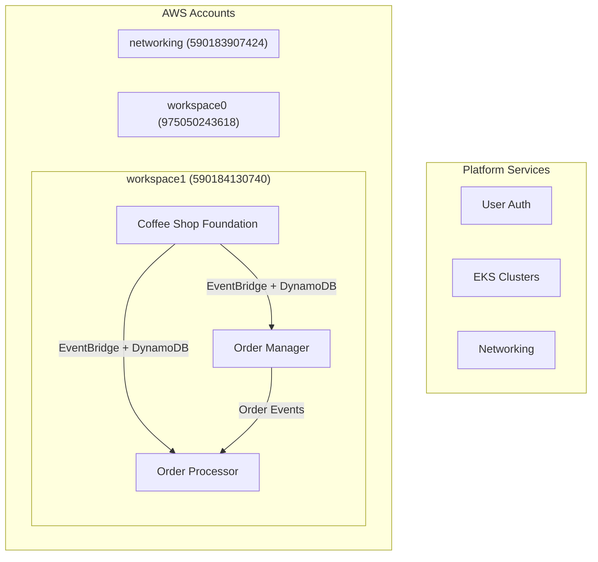

# ONDEMANDENV Contracts Sandbox

**The Central Architecture Definition for the ONDEMANDENV Demo Ecosystem**

[](https://github.com/ondemandenv/odmd-contracts-sandbox/packages/)
[](https://aws.amazon.com/cdk/)
[](LICENSE)

This repository serves as the **ContractsLib** for the ONDEMANDENV platform demonstration, defining the complete architecture and service contracts for a multi-service coffee shop application and supporting platform services.

---

## 🎯 What is ContractsLib?

In ONDEMANDENV, the **ContractsLib** is the central, code-defined hub where teams establish architectural agreements. Think of it as the **"Congress"** of your distributed system - where service boundaries, dependencies, and interactions are explicitly defined and managed through TypeScript code.

### Key Principles
- **Architecture as Code**: All service contracts defined in TypeScript with strong typing
- **Explicit Dependencies**: No hidden coupling - every dependency must be declared
- **Governance Through Code**: Changes require PR reviews and team agreement
- **Platform Integration**: ONDEMANDENV reads these contracts for orchestration

---

## 🏗️ Repository Structure

```
_contractsLib-sbx/
├── lib/
│   ├── OndemandContractsSandbox.ts    # Main contracts definition & orchestration
│   └── repos/                          # Service-specific contract definitions
│       ├── coffee-shop/               # Coffee shop microservices ecosystem
│       │   ├── coffee-shop-foundation-cdk.ts      # Shared infrastructure
│       │   ├── coffee-shop-order-manager-cdk.ts   # Order lifecycle management
│       │   └── coffee-shop-order-processor-cdk.ts # Order fulfillment processing
│       ├── _user-auth/                # Platform authentication service contracts
│       ├── _eks/                      # Platform EKS cluster service contracts
│       ├── _contracts/                # ContractsLib self-management contracts
│       └── sample-services/           # Additional example services
├── tests/                             # Contract validation tests
├── .scripts/                          # Build and deployment automation
└── docs/                              # Additional documentation
```

---

## ☕ Coffee Shop Demo Architecture

This ContractsLib defines a complete **event-driven microservices architecture** demonstrating core ONDEMANDENV patterns:



### 🏛️ Foundation Service (`coffee-shop-foundation`)
**Role**: Shared infrastructure provider
**Publishes**: 
- EventBridge custom bus for inter-service communication
- DynamoDB configuration table for application settings
- DynamoDB counter table for business metrics
- IAM roles and policies for consuming services

**Implementation**: [`coffee-shop--foundation`](../coffee-shop--foundation)

### 📋 Order Manager Service (`coffee-shop-order-manager`)  
**Role**: Order lifecycle orchestration  
**Consumes**: Foundation event bus, configuration table, counter table  
**Publishes**: Order APIs, order status events  
**Responsibilities**: 
- Order creation and validation
- Customer interaction management
- Order state machine orchestration

**Implementation**: [`coffee-shop--order-manager`](../coffee-shop--order-manager)

### ⚙️ Order Processor Service (`coffee-shop-order-processor`)
**Role**: Order fulfillment engine  
**Consumes**: Foundation event bus, configuration table, counter table  
**Publishes**: Fulfillment status events, inventory updates  
**Responsibilities**: 
- Payment processing integration
- Inventory management
- Fulfillment workflow execution

**Implementation**: [`coffee-shop--order-processor`](../coffee-shop--order-processor)

---

## 🔧 Key ONDEMANDENV Concepts Demonstrated

### 1. **Explicit Service Contracts**
```typescript
// Order Manager consumes from Foundation
export class CoffeeShopOrderManagerEnver extends OdmdEnverCdk {
    // Explicit dependency declaration
    readonly eventBusConsumer: OdmdCrossRefConsumer<CoffeeShopFoundationEnver>;
    readonly configTableConsumer: OdmdCrossRefConsumer<CoffeeShopFoundationEnver>;
    
    constructor() {
        const foundationEnver = this.contracts.coffeeShopFoundationCdk.theOne;
        this.eventBusConsumer = new OdmdCrossRefConsumer(
            this, 'EventBus', foundationEnver.eventBusSrc
        );
    }
}
```

### 2. **Cross-Account Deployment Strategy**
```typescript
// Targeted deployment across AWS accounts
export class OndemandContractsSandbox {
    accounts: {
        central: '590184031795',      // Platform management & orchestration
        networking: '590183907424',   // Shared VPC, TGW, Route53
        workspace0: '975050243618',   // Platform services (Auth, EKS)
        workspace1: '590184130740',   // Coffee shop application services
    }
}
```

### 3. **Product/Consumer Architecture Pattern**
- **Products**: Concrete outputs services provide (ARNs, URIs, configuration JSON)
- **Consumers**: Explicit declarations of dependencies on other services' Products
- **Platform Resolution**: ONDEMANDENV automatically resolves and injects dependencies

### 4. **Environment Versioning & Cloning**
```typescript
// Branch-based incremental environments
new CoffeeShopFoundationEnver(this, accounts.workspace1, 'us-west-1', 
    new SRC_Rev_REF('b', 'main'));  // Branch: main (incremental)

// Tag-based immutable environments  
new CoffeeShopFoundationEnver(this, accounts.workspace1, 'us-west-1',
    new SRC_Rev_REF('t', 'v1.2.0')); // Tag: v1.2.0 (immutable)
```

---

## 🌐 Platform Services Integration

### User Authentication (`OdmdBuildUserAuthSbx`)
- **Purpose**: Platform-wide authentication and authorization
- **Provides**: Cognito User Pool, OAuth integration, console access
- **Account**: workspace0

### EKS Clusters (`OdmdBuildEksSbx`)
- **Purpose**: Container orchestration platform
- **Provides**: EKS cluster endpoints, OIDC providers, kubectl access
- **Account**: workspace0
- **Integration**: Applications deploy workloads via IRSA and cdk8s

### Networking (`OdmdBuildNetworking`)
- **Purpose**: Cross-account connectivity infrastructure
- **Provides**: VPC configuration, subnet allocations, Transit Gateway
- **Account**: networking
- **Pattern**: Shared networking consumed by all application accounts

---

## 🔄 Development Workflow

### 1. **Architecture Evolution**
```bash
# Modify contracts in this repository
git checkout -b feature/add-payment-service
# Edit lib/repos/coffee-shop/coffee-shop-payment-cdk.ts
git commit -m "Add payment service contracts"
# PR Review → Platform updates CI/CD for affected services
```

### 2. **Service Dependency Management**
```typescript
// Add new consumer in service contract
export class OrderManagerEnver extends OdmdEnverCdk {
    // New dependency on payment service
    readonly paymentServiceConsumer: OdmdCrossRefConsumer<PaymentServiceEnver>;
}
```

### 3. **Environment Cloning for Development**
```bash
# In any service repository commit message:
git commit -m "feature: new payment integration

odmd: create@main"

# Platform automatically:
# ✅ Creates isolated environment with feature branch code
# ✅ Reuses exact dependency versions from 'main' environment  
# ✅ Provisions all AWS resources with unique naming
# ✅ Configures cross-service connectivity
```

### 4. **Testing & Validation**
```bash
npm run test              # Run contract validation tests
npm run build             # Compile TypeScript contracts
npm run cdk-ls            # List all defined CDK stacks
```

---

## 📊 Account & Resource Organization

### Multi-Account Strategy
```typescript
export const ACCOUNT_STRUCTURE = {
    // Platform Core
    central: {
        id: '590184031795',
        purpose: 'ONDEMANDENV platform engine & orchestration',
        services: ['Config Store', 'Event Bus', 'GitHub App', 'Platform APIs']
    },
    
    // Shared Infrastructure  
    networking: {
        id: '590183907424', 
        purpose: 'Cross-account networking & connectivity',
        services: ['VPCs', 'Transit Gateway', 'Route53', 'NAT Gateways']
    },
    
    // Platform Services
    workspace0: {
        id: '975050243618',
        purpose: 'Platform-provided services',
        services: ['User Authentication', 'EKS Clusters', 'Monitoring']  
    },
    
    // Application Workloads
    workspace1: {
        id: '590184130740',
        purpose: 'Coffee shop application services',
        services: ['Foundation', 'Order Manager', 'Order Processor']
}
};
```

### GitHub Repository Integration
```typescript
githubRepos: {
    // Application Services
    CoffeeShopFoundationCdk: {
        owner: 'ondemandenv',
        name: 'coffee-shop--foundation',
        ghAppInstallID: 41561130
    },
    CoffeeShopOrderManagerCdk: {
        owner: 'ondemandenv', 
        name: 'coffee-shop--order-manager',
        ghAppInstallID: 41561130
    },
    
    // Platform Services
    __userAuth: {
        owner: 'ondemandenv',
        name: 'user-pool', 
        ghAppInstallID: 41561130
    },
    
    // Sample/Template Services
    sampleVpcRds: {
        owner: 'ondemandenv',
        name: 'springcdk-rds',
        ghAppInstallID: 41561130
    }
}
```

---

## 🚀 Getting Started

### Prerequisites
- Node.js 18+ and npm
- AWS CLI configured with appropriate permissions  
- TypeScript knowledge
- Understanding of AWS CDK concepts

### 1. **Explore the Architecture**
```bash
# Clone and examine the contracts
git clone https://github.com/ondemandenv/odmd-contracts-sandbox.git
cd odmd-contracts-sandbox
npm install
npm run build

# Study the main contract definition
code lib/OndemandContractsSandbox.ts
```

### 2. **Understand Service Dependencies**
```bash
# Review coffee shop service contracts
ls lib/repos/coffee-shop/
code lib/repos/coffee-shop/coffee-shop-foundation-cdk.ts
```

### 3. **Examine Implementation Patterns**
```bash
# Look at corresponding CDK implementations
cd ../coffee-shop--foundation
code lib/coffee-shop-foundation-stack.ts
```

### 4. **Learn Platform Integration**
Visit [ondemandenv.dev](https://ondemandenv.dev) for comprehensive platform documentation

---

## 🏆 Key Benefits Demonstrated

### **Operational Excellence**
- **Explicit Dependencies**: Eliminates hidden service coupling
- **Version Management**: Clear environment lifecycle with branch/tag strategies  
- **Cross-Account Security**: Least-privilege access with platform-managed IAM
- **Automated Governance**: Contract changes require code review approval

### **Developer Productivity** 
- **On-Demand Environments**: Complete isolated environments for any feature branch
- **Platform Abstraction**: Complex AWS operations hidden from application teams
- **Unified Toolchain**: Single CDK codebase for infrastructure + runtime
- **AI-Ready Architecture**: Clear boundaries enable effective AI code generation

### **System Reliability**
- **Immutable Deployments**: Tag-based environments ensure reproducibility
- **Dependency Isolation**: Environment cloning prevents shared resource conflicts  
- **Automated Rollbacks**: CloudFormation handles infrastructure rollback automatically
- **Health Monitoring**: Built-in observability for all service interactions

---

## 📚 Related Documentation

- **[ONDEMANDENV Platform Guide](https://ondemandenv.dev/documentation)**: Complete platform setup and usage
- **[Core Concepts](https://ondemandenv.dev/concepts)**: Envers, ContractsLib, Cloning explained
- **[Patterns & Use Cases](https://ondemandenv.dev/patterns)**: Common implementation patterns
- **[Coffee Shop Services](../coffee-shop--foundation)**: Service implementation examples
- **[Contracts Base Library](../contracts-base)**: Core platform interfaces and types

---

## 🤝 Contributing

This sandbox ContractsLib serves as both a **working example** and **template** for organizations implementing ONDEMANDENV. 

1. **Study the Patterns**: Understand how contracts define architecture
2. **Extend for Your Use Case**: Add your own service definitions
3. **Share Improvements**: Contribute back patterns that benefit the community
4. **Ask Questions**: Join discussions about distributed system architecture

**Transform your distributed system complexity into explicit, code-driven architecture that enables true microservice agility.**